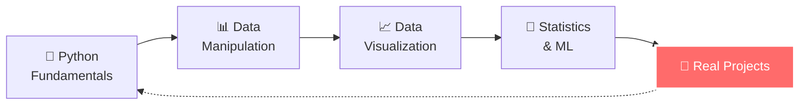
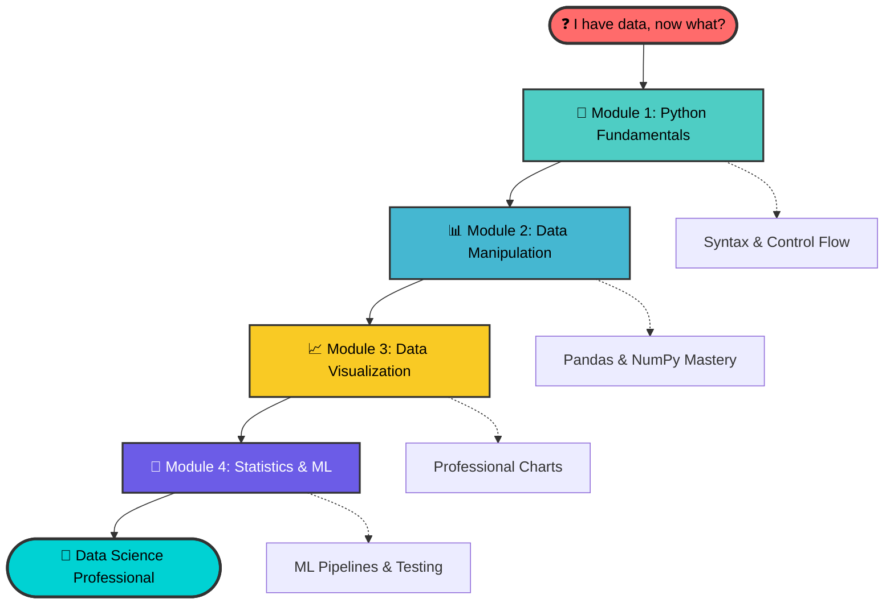
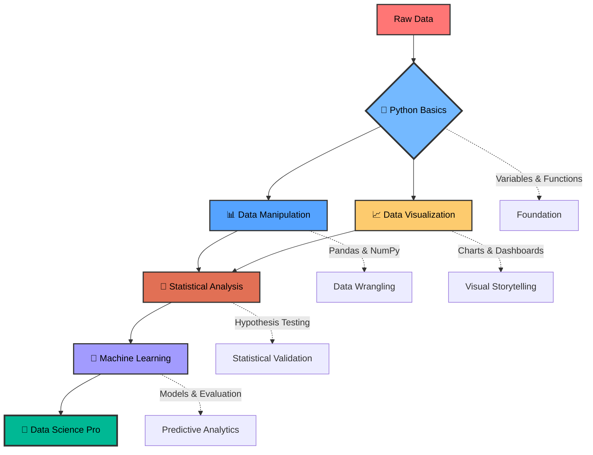
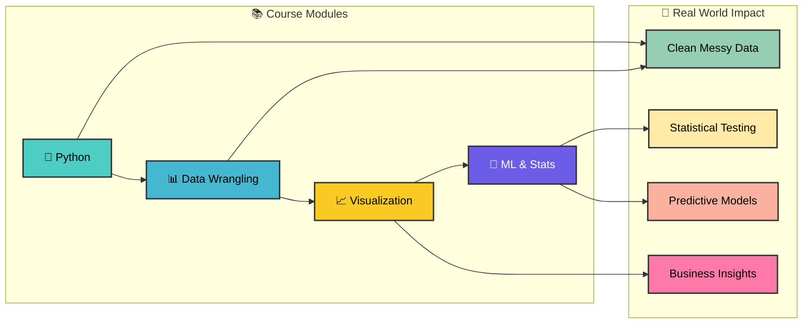

```
╔──────────────────────────────────────────────────────╗
│                                                      │
│ ██████╗ ██╗   ██╗███╗   ██╗                          │
│ ██╔══██╗██║   ██║████╗  ██║                          │
│ ██████╔╝██║   ██║██╔██╗ ██║                          │
│ ██╔══██╗██║   ██║██║╚██╗██║                          │
│ ██║  ██║╚██████╔╝██║ ╚████║██╗                       │
│ ╚═╝  ╚═╝ ╚═════╝ ╚═╝  ╚═══╝╚═╝                       │
│                                                      │
│ ██╗     ███████╗ █████╗ ██████╗ ███╗   ██╗           │
│ ██║     ██╔════╝██╔══██╗██╔══██╗████╗  ██║           │
│ ██║     █████╗  ███████║██████╔╝██╔██╗ ██║           │
│ ██║     ██╔══╝  ██╔══██║██╔══██╗██║╚██╗██║           │
│ ███████╗███████╗██║  ██║██║  ██║██║ ╚████║██╗        │
│ ╚══════╝╚══════╝╚═╝  ╚═╝╚═╝  ╚═╝╚═╝  ╚═══╝╚═╝        │
│                                                      │
│ ██████╗ ███████╗██████╗ ███████╗ █████╗ ████████╗    │
│ ██╔══██╗██╔════╝██╔══██╗██╔════╝██╔══██╗╚══██╔══╝    │
│ ██████╔╝█████╗  ██████╔╝█████╗  ███████║   ██║       │
│ ██╔══██╗██╔══╝  ██╔═══╝ ██╔══╝  ██╔══██║   ██║       │
│ ██║  ██║███████╗██║     ███████╗██║  ██║   ██║   ██╗ │
│ ╚═╝  ╚═╝╚══════╝╚═╝     ╚══════╝╚═╝  ╚═╝   ╚═╝   ╚═╝ │
│                                                      │
╚──────────────────────────────────────────────────────╝

```
# *📊 Data Science Essentials — MiniCourse Style*

[](https://www.python.org/downloads/)     
    
  

<!--
[]()

-->
> ***TL;DR:*** &nbsp; Python to ML — 4 modules — Python, Pandas, Visualization, ML/Stats  🚀

This is a complete Python-based mini-course designed for self-learners, analysts, and aspiring data scientists who want to **actually understand** what they're coding, not just copy-paste from tutorials.

Every module is battle-tested with realistic examples, clear explanations, and zero fluff. You'll go from "what's a variable?" to building ML pipelines that solve real problems.

## 🤔 Why Is the *`Code`* Written Like This?

This course is built for **absolute beginners** — no setup pain, no “what just happened?” moments:

- 🚀 **Copy-paste ready** → Runs instantly in Colab, Kaggle, Replit, or locally.
- 🪶 **Minimal abstractions** → No heavy classes or over-engineered functions — every step is visible.
- ⚡ **Zero setup headaches** → Open any file and run — no hidden configs or mystery dependencies.
- 🔍 **Step-by-step clarity** → Every transformation and decision is explicit, commented, and easy to follow.
- 🧪 **Tinker-friendly** → Change one line and instantly see the effect — learn by doing.

Perfect for experimenting, building confidence, and actually *enjoying* the learning process.

## 🎯 What Makes This Different

- 📉 **No theory overload** → Only concepts you’ll actually use in projects and interviews.
- 📊 **Realistic examples** → Sales data, customer segmentation, employee records — not just toy datasets.
- 🔄 **Complete workflows** → From messy CSV → clean data → visualizations → models.
- 🛠 **Battle-tested & commented** → Every script runs out-of-the-box, with comments that teach.
- 📂 **Logical progression** → Python basics → data wrangling → visualization → ML — in order, no jumps.

## 🚀 Learn Your Way - 7+ Different Platforms!

### 🎆 **NEW: Modern Learning Experience**
We've transformed the course into a **complete learning platform** with multiple ways to learn:

**📱 Quick Setup (30 seconds):**
```bash
# One command does everything!
git clone https://github.com/fahdshaikh/brainbytes-ds.git
cd brainbytes-ds
./setup.sh  # 🎯 Sets up everything automatically
```

### 🌍 **Choose Your Platform:**

**📓 Interactive Notebooks**
- Each module has `.py` + `.ipynb` versions
- Run code cell-by-cell with instant feedback
- Built-in playground sections for experimentation
- Perfect for Google Colab!

**🎯 Replit (Best for Python Scripts) NEW!**
- Click [](https://replit.com/new/github/fahdshaikh/brainbytes-ds) for instant Python environment
- Full IDE with file explorer and terminal
- Zero setup - runs `.py` files directly
- One-click sharing and collaboration

**🚀 Gitpod (Professional IDE) NEW!**
- Click [](https://gitpod.io/#https://github.com/fahdshaikh/brainbytes-ds) for complete VS Code environment
- Pre-configured with all extensions and packages
- Perfect for serious development and learning

**🐳 GitHub Codespaces (Cloud IDE)**
- Click "Code" → "Codespaces" for instant cloud development
- Pre-configured with VS Code, Jupyter Lab, and all packages
- No local installation needed!

**🌐 Binder (Notebook Focus)**
- Click [](https://mybinder.org/v2/gh/fahdshaikh/brainbytes-ds/main) for instant online notebooks
- Runs in your browser with zero configuration
- Perfect for workshops and quick demos

**🗃 Traditional Scripts**
- Original Python files for local development
- Copy-paste friendly for any environment
- Works anywhere Python runs

**🔥 Google Colab (Beginner Favorite)**
- Upload any `.py` or `.ipynb` file → Start learning instantly
- All libraries pre-installed
- Free GPU access for ML modules!

## 📚 Learning Path





## 📁 Course Modules

| Module | Focus Area | Key Skills |
|--------|------------|------------|
| **[🐍 Python Fundamentals](./1_python_fundamentals/)** | Core Language | Variables, functions, control flow, data structures |
| **[📊 Data Manipulation](./2_data_manipulation/)** | Data Wrangling | NumPy arrays, Pandas DataFrames, cleaning workflows |
| **[📈 Data Visualization](./3_data_visualization/)** | Visual Storytelling | Statistical plots, business dashboards, publication-ready charts |
| **[🤖 Statistics & ML](./4_statistics_ml/)** | Predictive Modeling | Hypothesis testing, regression, classification, model evaluation |

<!--

## 🚀 Quick Start

### Prerequisites
- Python 3.10+ installed
- Basic curiosity about data
- Basic familiarity with coding in Python

### Setup
```bash
# Clone the repository
git clone https://github.com/fahdshaikh/brainbytes-ds.git
cd brainbytes-ds

# Install dependencies
pip install -r requirements.txt

# Start with fundamentals
cd 1_python_fundamentals
python 1_python_fundamentals.py
```

-->

### What's Included

```
📦 brainbytes-ds/
├── 🐍 1_python_fundamentals/     # Language basics that actually matter
│   ├── 1_python_fundamentals.py   # Original script
│   └── 1_python_fundamentals.ipynb # NEW: Interactive notebook
├── 📊 2_data_manipulation/       # NumPy + Pandas for real data work
├── 📈 3_data_visualization/      # Beautiful, meaningful charts  
├── 🤖 4_statistics_ml/          # From hypothesis tests to ML pipelines
├── 🚀 templates/                 # NEW: Project starter templates
│   ├── quick_analysis_template.ipynb
│   └── ml_project_template.ipynb
├── 📊 PROGRESS_TRACKER.md        # NEW: Learning checklist system
├── 🔧 setup.sh                   # NEW: One-command setup
├── 🤝 CONTRIBUTING.md           # NEW: Contribution guide
└── 📋 requirements.txt          # numpy, pandas, matplotlib, seaborn, scikit-learn, scipy
```

## 🎆 **NEW Features (2024 Update)**

**📊 Learning Experience 2.0:**
- 📓 **Jupyter Notebooks** → Interactive learning with playgrounds
- 📊 **Progress Tracker** → Checklist system with skill assessments  
- ⚡ **Quick Setup** → `./setup.sh` does everything automatically
- 📚 **Quick References** → Cheat sheets for instant lookup
- 🟢🟡🔴 **Difficulty Levels** → Clear progression indicators

**🌍 Multi-Platform Support:**
- 🐳 **GitHub Codespaces** → Instant cloud development environment
- 🌐 **Binder** → Zero-setup online notebooks
- 🔥 **Google Colab** → Enhanced notebook compatibility
- 🗃 **Local Development** → Improved with automated setup

**🤖 Professional Features:**
- 🔧 **Project Templates** → Analysis & ML project starters
- 🤝 **Contributing Guide** → Professional collaboration workflow  
- 🎨 **GitHub Actions** → Automated testing on every push
- 📜 **MIT License** → Open source collaboration ready

## 🗺️ Roadmap / Growth Plan

| Module | Current Status | Planned Additions |
|--------|----------------|-------------------|
| **🐍 Python Fundamentals** | Core syntax complete | More exercises, common mistake fixes, mini challenges |
| **📊 Data Manipulation** | Pandas basics done | Date handling, advanced groupby, boolean indexing deep-dive |
| **📈 Data Visualization** | Basic plots ready | Box plots, heatmaps, simple styling, side-by-side comparisons |
| **🤖 Statistics & ML** | Models working | Metrics breakdown (precision/recall/F1/ROC-AUC), overfitting demos |
| **🚀 Real Projects** | *Coming soon* | 2 end-to-end projects: customer analysis + sales forecasting |




## 💡 Learning Philosophy



**This isn't another tutorial dump.** Every concept is introduced with:
- ✅ **Why it matters** in real projects
- ✅ **When to use it** vs alternatives
- ✅ **Common mistakes** to avoid
- ✅ **Business context** that makes it stick

You'll understand the *thinking* behind data science, not just the syntax.

## 🎯 Perfect For

- **Career Changers** → Solid foundation without academic overwhelm
- **Analysts** → Level up from Excel to Python-powered insights
- **Students** → Practical skills that complement theoretical courses
- **Interview Prep** → Concepts and code patterns that actually get asked

## 🌟 What You'll Build

By the end of this course, you'll have working knowledge of:

```python
# Real examples you'll create:
📊 Sales performance dashboard with statistical insights
🧹 Data cleaning pipeline for messy CSV files
📈 Executive-ready visualizations with business context
🤖 Complete ML pipeline: data → model → evaluation → insights
🔍 A/B test analysis with proper statistical testing
📋 Feature engineering and model comparison workflows
```
## 🙋‍♀️ FAQ

**Q: I get `ModuleNotFoundError` when running locally**
A: Run `pip install -r requirements.txt` first, or use Colab which has everything pre-installed.

**Q: Colab can't save my charts — what do I do?**
A: Add `plt.show()` after each chart to display it, then right-click to save the image.

**Q: My pandas DataFrame printout is huge and messy**
A: Use `.head()` to see first 5 rows, or `pd.set_option('display.max_columns', 10)` to limit columns.

**Q: Should I memorize all this code?**
A: No! Focus on understanding patterns. The goal is knowing what's possible, not memorizing syntax.

**Q: I'm stuck on a concept — what should I do?**
A: Try changing one variable at a time to see what happens. Each file is designed for safe experimentation.

## 🤝 Contributing

Found a bug? Have a suggestion? Feel free to:
- 🐛 [Open an issue](https://github.com/fahdshaikh/brainbytes-ds/issues)
- 🔀 Submit a pull request
- ⭐ Star the repo if it helped you!

## ✨ Credits

Built by [@fahdshaikh1997](https://github.com/fahdshaikh1997) with extensive help from Claude AI and ChatGPT for explanations, code review, and making complex concepts accessible.
This project represents countless hours of research, testing, and refinement to create something genuinely useful for the data science community.

**Ready to transform from data curious to data capable?** 🚀
Start your journey: **[🐍 Python Fundamentals →](./1_python_fundamentals/)**

---

<div align="right">

**Made with *❤️* &nbsp; for the data science community**

</div>

<!--
**Made with *❤️* for the data science community**
[](https://github.com/fahdshaikh/brainbytes-ds)
[](https://github.com/fahdshaikh/brainbytes-ds/fork)
