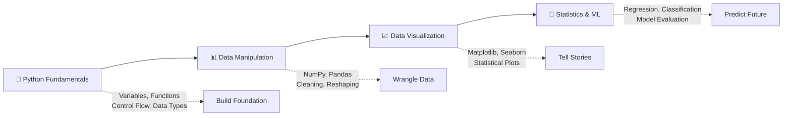

```
╔─────────────────────────────────────────────────────────────────────────────────────────────────────────────────────────────────────────╗
│                                                                                                                                         │
│ ██████╗ ██╗   ██╗███╗   ██╗       ██╗     ███████╗ █████╗ ██████╗ ███╗   ██╗       ██████╗ ███████╗██████╗ ███████╗ █████╗ ████████╗    │
│ ██╔══██╗██║   ██║████╗  ██║       ██║     ██╔════╝██╔══██╗██╔══██╗████╗  ██║       ██╔══██╗██╔════╝██╔══██╗██╔════╝██╔══██╗╚══██╔══╝    │
│ ██████╔╝██║   ██║██╔██╗ ██║       ██║     █████╗  ███████║██████╔╝██╔██╗ ██║       ██████╔╝█████╗  ██████╔╝█████╗  ███████║   ██║       │
│ ██╔══██╗██║   ██║██║╚██╗██║       ██║     ██╔══╝  ██╔══██║██╔══██╗██║╚██╗██║       ██╔══██╗██╔══╝  ██╔═══╝ ██╔══╝  ██╔══██║   ██║       │
│ ██║  ██║╚██████╔╝██║ ╚████║██╗    ███████╗███████╗██║  ██║██║  ██║██║ ╚████║██╗    ██║  ██║███████╗██║     ███████╗██║  ██║   ██║   ██╗ │
│ ╚═╝  ╚═╝ ╚═════╝ ╚═╝  ╚═══╝╚═╝    ╚══════╝╚══════╝╚═╝  ╚═╝╚═╝  ╚═╝╚═╝  ╚═══╝╚═╝    ╚═╝  ╚═╝╚══════╝╚═╝     ╚══════╝╚═╝  ╚═╝   ╚═╝   ╚═╝ │
│                                                                                                                                         │
╚─────────────────────────────────────────────────────────────────────────────────────────────────────────────────────────────────────────╝

╔──────────────────────────────────────────────────────╗
│                                                      │
│ ██████╗ ██╗   ██╗███╗   ██╗                          │
│ ██╔══██╗██║   ██║████╗  ██║                          │
│ ██████╔╝██║   ██║██╔██╗ ██║                          │
│ ██╔══██╗██║   ██║██║╚██╗██║                          │
│ ██║  ██║╚██████╔╝██║ ╚████║██╗                       │
│ ╚═╝  ╚═╝ ╚═════╝ ╚═╝  ╚═══╝╚═╝                       │
│                                                      │
│ ██╗     ███████╗ █████╗ ██████╗ ███╗   ██╗           │
│ ██║     ██╔════╝██╔══██╗██╔══██╗████╗  ██║           │
│ ██║     █████╗  ███████║██████╔╝██╔██╗ ██║           │
│ ██║     ██╔══╝  ██╔══██║██╔══██╗██║╚██╗██║           │
│ ███████╗███████╗██║  ██║██║  ██║██║ ╚████║██╗        │
│ ╚══════╝╚══════╝╚═╝  ╚═╝╚═╝  ╚═╝╚═╝  ╚═══╝╚═╝        │
│                                                      │
│ ██████╗ ███████╗██████╗ ███████╗ █████╗ ████████╗    │
│ ██╔══██╗██╔════╝██╔══██╗██╔════╝██╔══██╗╚══██╔══╝    │
│ ██████╔╝█████╗  ██████╔╝█████╗  ███████║   ██║       │
│ ██╔══██╗██╔══╝  ██╔═══╝ ██╔══╝  ██╔══██║   ██║       │
│ ██║  ██║███████╗██║     ███████╗██║  ██║   ██║   ██╗ │
│ ╚═╝  ╚═╝╚══════╝╚═╝     ╚══════╝╚═╝  ╚═╝   ╚═╝   ╚═╝ │
│                                                      │
╚──────────────────────────────────────────────────────╝

```

# 🧠 Data Science Cheatsheet: MiniCourse Edition

[](https://www.python.org/downloads/)
<!-- [](LICENSE)  -->
[]()
[]()


> **A practical, hands-on journey from Python basics to machine learning mastery**

This is a complete Python-based mini-course designed for self-learners, analysts, and aspiring data scientists who want to **actually understand** what they're coding, not just copy-paste from tutorials.

Every module is battle-tested with realistic examples, clear explanations, and zero fluff. You'll go from "what's a variable?" to building ML pipelines that solve real problems.

## 🎯 What Makes This Different

- **No Theory Overload** → Just the concepts that show up in real projects and interviews
- **Realistic Examples** → Employee data, sales analysis, customer segmentation - not toy problems
- **Complete Workflows** → From messy CSV to deployed model, see how everything connects
- **Battle-Tested Code** → Every line runs perfectly, extensively commented for learning

## 📚 Learning Path


```mermaid
graph LR
    A[🐍 Python Fundamentals] --> B[📊 Data Manipulation]
    B --> C[📈 Data Visualization]
    C --> D[🤖 Statistics & ML]

    A -.-> |"Variables, Functions<br/>Control Flow, Data Types"| A1[Build Foundation]
    B -.-> |"NumPy, Pandas<br/>Cleaning, Reshaping"| B1[Wrangle Data]
    C -.-> |"Matplotlib, Seaborn<br/>Statistical Plots"| C1[Tell Stories]
    D -.-> |"Regression, Classification<br/>Model Evaluation"| D1[Predict Future]
```

## 📁 Course Modules

| Module | Focus Area | Key Skills |
|--------|------------|------------|
| **[🐍 Python Fundamentals](./1_python_fundamentals/)** | Core Language | Variables, functions, control flow, data structures |
| **[📊 Data Manipulation](./2_data_manipulation/)** | Data Wrangling | NumPy arrays, Pandas DataFrames, cleaning workflows |
| **[📈 Data Visualization](./3_data_visualization/)** | Visual Storytelling | Statistical plots, business dashboards, publication-ready charts |
| **[🤖 Statistics & ML](./4_statistics_ml/)** | Predictive Modeling | Hypothesis testing, regression, classification, model evaluation |

## 🚀 Quick Start

### Prerequisites
- Python 3.7+ installed
- Basic curiosity about data
- No prior experience needed!

### Setup
```bash
# Clone the repository
git clone https://github.com/fahdshaikh1997/cheatsheet_ds_minicourse.git
cd cheatsheet_ds_minicourse

# Install dependencies
pip install -r requirements.txt

# Start with fundamentals
cd 1_python_fundamentals
python 1_python_fundamentals.py
```

### What's Included
```
📦 cheatsheet_ds_minicourse/
├── 🐍 1_python_fundamentals/     # Language basics that actually matter
├── 📊 2_data_manipulation/       # NumPy + Pandas for real data work
├── 📈 3_data_visualization/      # Beautiful, meaningful charts
├── 🤖 4_statistics_ml/          # From hypothesis tests to ML pipelines
└── 📋 requirements.txt          # numpy, pandas, matplotlib, seaborn, scikit-learn, scipy
```

## 💡 Learning Philosophy

**This isn't another tutorial dump.** Every concept is introduced with:
- ✅ **Why it matters** in real projects
- ✅ **When to use it** vs alternatives
- ✅ **Common mistakes** to avoid
- ✅ **Business context** that makes it stick

You'll understand the *thinking* behind data science, not just the syntax.

## 🎯 Perfect For

- **Career Changers** → Solid foundation without academic overwhelm
- **Analysts** → Level up from Excel to Python-powered insights
- **Students** → Practical skills that complement theoretical courses
- **Interview Prep** → Concepts and code patterns that actually get asked

## 🌟 What You'll Build

By the end of this course, you'll have working knowledge of:

```python
# Real examples you'll create:
📊 Sales performance dashboard with statistical insights
🧹 Data cleaning pipeline for messy CSV files
📈 Executive-ready visualizations with business context
🤖 Complete ML pipeline: data → model → evaluation → insights
🔍 A/B test analysis with proper statistical testing
📋 Feature engineering and model comparison workflows
```

## 🏆 Success Stories

*"Finally, a data science course that doesn't assume I have a PhD in math. The examples are so practical - I used the pandas techniques at work the next day!"*

*"The ML section is gold. Shows you how to actually evaluate models, not just fit them and hope for the best."*

## 🤝 Contributing

Found a bug? Have a suggestion? Feel free to:
- 🐛 [Open an issue](https://github.com/fahdshaikh1997/cheatsheet_ds_minicourse/issues)
- 🔀 Submit a pull request
- ⭐ Star the repo if it helped you!

## 🙏 Credits

Built by [@fahdshaikh1997](https://github.com/fahdshaikh1997) with extensive help from Claude AI and ChatGPT for explanations, code review, and making complex concepts accessible.

This project represents countless hours of research, testing, and refinement to create something genuinely useful for the data science community.

**Ready to transform from data curious to data capable?** 🚀

Start your journey: **[🐍 Python Fundamentals →](./1_python_fundamentals/)**

---

<div align="center">

[](https://github.com/fahdshaikh1997/cheatsheet_ds_minicourse)
[](https://github.com/fahdshaikh1997/cheatsheet_ds_minicourse/fork)

**Made with ❤️ for the data science community**

</div>
